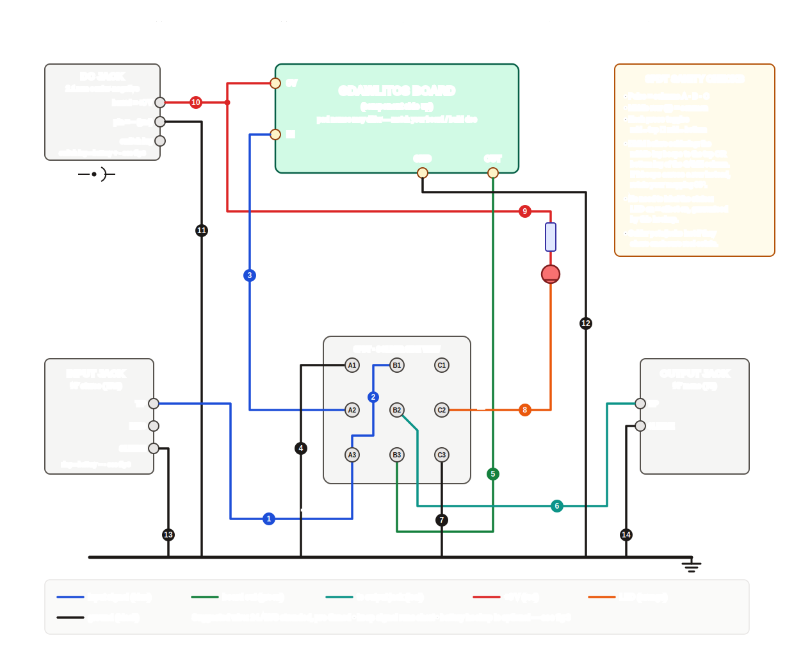

<!-- SPDX-License-Identifier: MIT -->
# gdawlitos — wiring map & solder checklist

Labelled off-board wiring for the **gdawlitos** build: board ↔ 3PDT true-bypass
footswitch ↔ jacks ↔ DC power ↔ status LED, plus pot/LED orientation
references. This is the universal hand-soldered harness — it is correct for any
single-board 9 V pedal with true bypass. Anything **circuit-specific** (pot lug
destinations, extra toggles, on-board LED pads) comes from the gdawlitos board
silk / build doc; hookup points for those are called out where they plug in.

| Figure | Contents |
|---|---|
| [fig 1 — overview](fig1-overview.svg) | Full off-board wiring map; wire numbers match the solder table below |
| [fig 2 — 3PDT states](fig2-3pdt-states.svg) | Switch internals in bypass vs. effect, lug-by-lug map, DMM check |
| [fig 3 — jacks & power](fig3-jacks-power.svg) | Jack/DC lug identification, polarity, optional battery hookup |
| [fig 4 — pots & LED](fig4-pots-led.svg) | Pot lug numbering (front vs. solder side), LED polarity |

## Wire-by-wire solder map

Numbers 1–14 match the badges in fig 1; battery wires 15–16 are drawn in
fig 3. All lug names (`A1`…`C3`) are as seen from
the **solder side** of the 3PDT: columns A·B·C, rows 1 (top) · 2 (middle =
common) · 3 (bottom).

| # | From | To | Color | Notes |
|---|------|----|-------|-------|
| 1 | Input jack **TIP** | 3PDT **A3** | blue | Guitar signal in |
| 2 | 3PDT **A3** | 3PDT **B1** | blue | Short jumper; bare bus wire is fine |
| 3 | 3PDT **A2** | Board **IN** pad | blue | Signal into the circuit |
| 4 | 3PDT **A1** | Ground bus | black | Grounds board input in bypass (anti-pop) |
| 5 | Board **OUT** pad | 3PDT **B3** | green | Circuit output |
| 6 | 3PDT **B2** | Output jack **TIP** | teal | Signal out |
| 7 | 3PDT **C3** | Ground bus | black | May jumper to A1, then one wire to ground |
| 8 | 3PDT **C2** | LED **cathode** (−, flat side) | orange | LED switching |
| 9 | +9 V → **CLR 4k7** → LED **anode** (+, long leg) | — | red | Skip if the board has on-board LED pads — then use those |
| 10 | DC jack **barrel** lug (+) | Board **9V** pad | red | Center-negative: barrel contact is +9 V |
| 11 | DC jack **pin** lug (−) | Ground bus | black | Center pin is negative! |
| 12 | Board **GND** pad | Ground bus | black | |
| 13 | Input jack **SLEEVE** | Ground bus | black | |
| 14 | Output jack **SLEEVE** | Ground bus | black | |
| 15* | DC jack **switch** lug | Battery snap **red** (+) | red | Optional battery; see fig 3 caveat before wiring |
| 16* | Battery snap **black** (−) | Input jack **RING** | black | Stereo input jack = battery on/off switch |

\* Optional — only if you want battery power. Skip both for adapter-only builds.

**Ground bus** = star or daisy-chain joining: DC pin lug, board GND, A1, C3,
input sleeve, output sleeve. Metal jack bushings ground the enclosure
automatically (scrape paint under one lock washer on powder-coated boxes).

## Build order checklist

**Bench (switch not yet mounted):**

- [ ] DMM the 3PDT: confirm each **middle** lug beeps to the top *or* bottom lug
      of the **same column**, toggling per press. If it beeps across a row,
      rotate your mapping 90° (fig 2).
- [ ] DMM the DC jack: identify pin / barrel / switch lugs (fig 3).
- [ ] Cut wires with ~2 cm slack after a test-fit in the enclosure; pre-tin
      everything.
- [ ] Solder jumper **2** on the switch, and tails for **1, 3, 4, 5, 6, 7, 8**
      (leave free ends).

**In the enclosure (hardware mounted):**

- [ ] Power first: **10**, **11** — then meter it: barrel↔9V pad beeps,
      barrel↔ground does **not**.
- [ ] Grounds: **12, 13, 14**, then terminate **4** and **7**.
- [ ] Signal: terminate **1** at the input tip, **3** at board IN, **5** at
      board OUT, **6** at the output tip.
- [ ] LED: **8**, **9** (mind polarity — fig 4). If LED is board-mounted, skip.
- [ ] Battery (optional): **15**, **16** after reading the fig 3 caveat.
- [ ] Pots: per the gdawlitos board doc. Remember the lug order **flips** when
      viewed from the solder side (fig 4).

**Pre-flight (before first power):**

- [ ] DC pin lug ↔ input sleeve: **beep** (ground net complete)
- [ ] DC barrel lug ↔ board 9V pad: **beep**; barrel ↔ ground: **no beep**
- [ ] Input tip ↔ output tip: beeps in one switch state (bypass), not the other
- [ ] LED orientation double-checked (flat side → C2)

**First power-up:** use a current-limited supply or check idle draw in series
with a DMM if you have one. LED should toggle with the switch; bypass should
pass guitar cleanly; then verify the effect path.

## Troubleshooting quick hits

| Symptom | Look at |
|---|---|
| LED never lights / always on | Pole C wiring (7, 8, 9) or switch mapping rotated — redo the fig 2 DMM check |
| Bypass works, effect silent | 3 and 5 swapped (board IN/OUT), or board-side issue |
| Effect works, bypass silent | Jumper 2 missing/cold, or B1/B2 solder joints |
| Loud pop on switching | Board pulldown resistors (board-side), or LED CLR too small |
| Works on adapter, dead on battery | DC jack switch-lug pairing — fig 3 caveat |
| Hum on adapter only | Non-isolated daisy chain; try an isolated supply |
| Everything dead, adapter warm | **Polarity!** Power off, re-check 10/11 against fig 3 |

## Conventions

- Wire: 24 AWG stranded, pre-tinned; keep signal runs short.
- Colors as drawn: blue = input signal, green = board out, teal = to output
  jack, red = +9 V, orange = LED, black = ground.
- 3PDT drawn from the solder side everywhere in these figures.
- Pot lugs numbered 1-2-3 **viewed from the front** (shaft toward you, lugs
  down); lug 2 is always the wiper.
